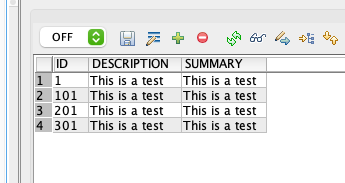
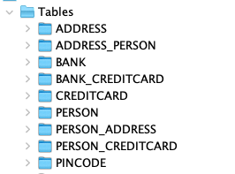

# DAT250: Software Technology Experiment Assignment 2

## Small excercise

This is how I think the tables and columns will look:

```sql
CREATE TABLE Person (
  Id CHAR(16) NOT NULL,
  Name VARCHAR(MAX) NOT NULL,
  PRIMARY KEY (Id)
)

CREATE TABLE Address (
  Id CHAR(16) NOT NULL,
  Street VARCHAR(MAX) NOT NULL,
  Number INTEGER,
  PRIMARY KEY (Id)
)

CREATE TABLE PersonAddressLookup (
  PersonId CHAR(16) NOT NULL,
  AddressId CHAR(16) NOT NULL,
  FOREIGN KEY PersonId REFERENCES Person (Id),
  FOREIGN KEY AddressId REFERENCES Address (Id)
)

CREATE TABLE CreditCard (
  Id CHAR(16) NOT NULL,
  PersonId CHAR(16) NOT NULL,
  BankId CHAR(16) NOT NULL,
  PincodeId CHAR(16) NOT NULL,
  Number INTEGER,
  Limit INTEGER,
  Balance INTEGER,
  PRIMARY KEY (Id),
  FOREIGN KEY BankId REFERENCES Bank (Id),
  FOREIGN KEY PersonId REFERENCES Person (Id),
  FOREIGN KEY PincodeId REFERENCES Pincode (Id),
)

CREATE TABLE Bank (
  Id CHAR(16) NOT NULL
  Name VARCHAR(MAX) NOT NULL,
  PRIMARY KEY (Id)
)

CREATE TABLE Pincode (
  Id CHAR(16) NOT NULL
  Pincode VARCHAR(MAX) NOT NULL,
  Count INTEGER,
  PRIMARY KEY (Id)
)
```

## Experiment 1

The code run correctly and added the following rows to the database:


## Experiment 2

Similarly to exp 1, the code in experiment 2 ran as expected. We can see in the picture below that the DB tables were added:


## Technical problems

I had some troubles finding a good DB explorer that handles Derby databases. At the end I ended up with RazorSQL.
